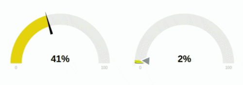

# JustGage

<p align="center"></p>

[](https://www.npmjs.com/package/justgage)

[](http://makeapullrequest.com)
[](https://opensource.org/licenses/mit-license.php)

[](https://nodei.co/npm/justgage/)

JustGage is a handy JavaScript plugin for generating and animating nice &amp; clean dashboard gauges. It is based on Raphaël library for vector drawing.

<p align="center"></p>

- [JustGage](#justgage)
  - [Getting Started](#getting-started)
  - [Basic usage](#basic-usage)
  - [Options](#options)
    - [Custom Sectors](#custom-sectors)
    - [Pointer options](#pointer-options)
  - [Methods](#methods)
    - [Refresh](#refresh)
    - [Update](#update)
      - [Update Options](#update-options)
    - [Destroy](#destroy)
  - [Demo](#demo)
  - [Examples](#examples)
  - [Changelog](#changelog)
    - [BREAKING CHANGES](#breaking-changes)
  - [License](#license)
  - [Author](#author)

## Getting Started

Installing Justgage is as easy as...

```bash
bower install justgage-official
```

or maybe you wish to use NPM...

```bash
npm install justgage --save
```

- Example **[NPM setup using Browserfy](https://github.com/deezone/justgage-npm-sample)**

or you can always download the CSS and JS files...

```html
<!-- Raphael must be included before justgage -->
<script type="text/javascript" src="path/to/raphael.min.js"></script>
<script type="text/javascript" src="path/to/justgage.js"></script>
```

or if even don't want to download the files use [cdnjs](https://cdnjs.com/libraries/justgage)

```html
<!-- Raphael must be included before justgage -->
<script type="text/javascript" src="https://cdnjs.cloudflare.com/ajax/libs/raphael/2.1.4/raphael-min.js"></script>
<script type="text/javascript" src="https://cdnjs.cloudflare.com/ajax/libs/justgage/1.2.9/justgage.min.js"></script>
```

## Basic usage

**Html**

```html
<div id="gauge"></div>
```

**JS**

```js

var gauge = new JustGage({
            id: "gauge", // the id of the html element
            value: 50,
            min: 0,
            max: 100,
            decimals: 2,
            gaugeWidthScale: 0.6
        });

// update the value randomly
setInterval(() => {
  gauge.refresh(Math.random() * 100);
}, 5000)

```

## Options

| Name                 | Default                             | Description                                                                         |
| -------------------- | ----------------------------------- | ----------------------------------------------------------------------------------- |
| id                   | (required)                          | The HTML container element `id`                                                     |
| value                | `0`                                 | Value Gauge is showing                                                              |
| parentNode           | `null`                              | The HTML container element object. Used if `id` is not present                      |
| defaults             | `false`                             | Defaults parameters to use globally for gauge objects                               |
| width                | `null`                              | The Gauge width in pixels (Integer)                                                 |
| height               | `null`                              | The Gauge height in pixels                                                          |
| valueFontColor       | `#010101`                           | Color of label showing current value                                                |
| valueFontFamily      | `Arial`                             | Font of label showing current value                                                 |
| symbol               | `''`                                | Special symbol to show next to value                                                |
| min                  | `0`                                 | Min value                                                                           |
| minTxt               | `false`                             | Min value text, overrides `min` if specified                                        |
| max                  | `100`                               | Max value                                                                           |
| maxTxt               | `false`                             | Max value text, overrides `max` if specified                                        |
| reverse              | `false`                             | Reverse min and max                                                                 |
| humanFriendlyDecimal | `0`                                 | Number of decimal places for our human friendly number to contain                   |
| textRenderer         | `null`                              | Function applied before redering text `(value) => value`                            |
| onAnimationEnd       | `null`                              | Function applied after animation is done                                            |
| gaugeWidthScale      | `1.0`                               | Width of the gauge element                                                          |
| gaugeColor           | `#edebeb`                           | Background color of gauge element                                                   |
| label                | `''`                                | Text to show below value                                                            |
| labelFontColor       | `#b3b3b3`                           | Color of label showing label under value                                            |
| shadowOpacity        | `0.2`                               | Shadow opacity 0 ~ 1                                                                |
| shadowSize           | `5`                                 | Inner shadow size                                                                   |
| shadowVerticalOffset | `3`                                 | How much shadow is offset from top                                                  |
| levelColors          | `["#a9d70b", "#f9c802", "#ff0000"]` | Colors of indicator, from lower to upper, in RGB format                             |
| startAnimationTime   | `700`                               | Length of initial animation in milliseconds                                         |
| startAnimationType   | `>`                                 | Type of initial animation (linear, >, <,  <>, bounce)                               |
| refreshAnimationTime | `700`                               | Length of refresh animation in milliseconds                                         |
| refreshAnimationType | `>`                                 | Type of refresh animation (linear, >, <,  <>, bounce)                               |
| donutStartAngle      | `90`                                | Angle to start from when in donut mode                                              |
| valueMinFontSize     | `16`                                | Absolute minimum font size for the value label                                      |
| labelMinFontSize     | `10`                                | Absolute minimum font size for the label                                            |
| minLabelMinFontSize  | `10`                                | Absolute minimum font size for the min label                                        |
| maxLabelMinFontSize  | `10`                                | Absolute minimum font size for the man label                                        |
| hideValue            | `false`                             | Hide value text                                                                     |
| hideMinMax           | `false`                             | Hide min/max text                                                                   |
| showInnerShadow      | `false`                             | Show inner shadow                                                                   |
| humanFriendly        | `false`                             | convert large numbers for min, max, value to human friendly (e.g. 1234567 -> 1.23M) |
| noGradient           | `false`                             | Whether to use gradual color change for value, or sector-based                      |
| donut                | `false`                             | Show donut gauge                                                                    |
| relativeGaugeSize    | `false`                             | Whether gauge size should follow changes in container element size                  |
| counter              | `false`                             | Animate text value number change                                                    |
| decimals             | `0`                                 | Number of digits after floating point                                               |
| customSectors        | `{}`                                | Custom sectors colors. Expects an [object](#Custom-Sectors)                         |
| formatNumber         | `false`                             | Formats numbers with commas where appropriate                                       |
| pointer              | `false`                             | Show value pointer                                                                  |
| pointerOptions       | `{}`                                | Pointer options. Expects an [object](#Pointer-options)                              |
| displayRemaining     | `false`                             | Replace display number with the value remaining to reach max value                  |

### Custom Sectors

Example:

```js
customSectors: {
  percents: true, // lo and hi values are in %
  ranges: [{
    color : "#43bf58",
    lo : 0,
    hi : 50
  },
  {
    color : "#ff3b30",
    lo : 51,
    hi : 100
  }]
}
```

### Pointer options

Example:

```js
pointerOptions: {
  toplength: null,
  bottomlength: null,
  bottomwidth: null,
  stroke: 'none',
  stroke_width: 0,
  stroke_linecap: 'square',
  color: '#000000'
}
```

## Methods

### Refresh

Used to refresh Gauge value and max value

`guage.refresh(val, max, min, label)`

- `val` : The Gauge value (required)
- `max` : The Gauge Max value (optional)
- `min` : The Gauge Min value (optional)
- `label` : The Gauge label text (optional)

### Update

Used to dynamically update existing Gauge appearence

`gauge.update(option, value)`

vs

```js
const options = {
  valueFontColor: '#ff0000',
  labelFontColor: '#ff0000',
}
gauge.update(options)
```

#### Update Options

| Name                 | Description                                 |
| -------------------- | ------------------------------------------- |
| valueFontColor       | HEX color for gauge value text              |
| labelFontColor       | HEX color for gauge min, max and label text |

### Destroy

Used to destroy the Gauge element

`guage.destroy()`

## Demo

Click [here](https://toorshia.github.io/justgage) to see a demo

## Examples

Click [here](https://toorshia.github.io/justgage/#demos) for a list of examples

## Changelog

Check out the auto-generated [Changelog](CHANGELOG.md)

Or [here](CHANGELOG_OLD.md) you can find the old changelog (up to version 1.2.9)

### BREAKING CHANGES

- 1.2.9
  - `customSectors` expects an object and not an array (percent support, check docs for more info)
- 1.2.6
  - Removed `title` feature

## License

This project is licensed under [MIT](LICENSE) License

## Author

- [Bojan Djuricic](https://github.com/toorshia)
