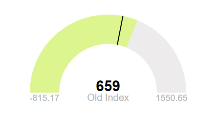

# JustGage

<p align="center"></p>

[](https://www.npmjs.com/package/justgage)
[](https://www.npmjs.com/package/justgage)
[](https://bundlephobia.com/package/justgage)

[](https://github.com/toorshia/justgage/actions/workflows/deploy-docs.yml)
[](https://github.com/toorshia/justgage/actions/workflows/ci.yml)

[](http://makeapullrequest.com)
[](https://opensource.org/licenses/mit-license.php)
[](https://conventionalcommits.org)

[](https://nodei.co/npm/justgage/)

JustGage is a handy JavaScript plugin for generating and animating nice &amp; clean dashboard gauges. **Version 2.0+ features a modern ES6+ implementation with native SVG rendering and zero dependencies.**

> 🚀 **New in v2.0-alpha.1:** Zero dependencies, native SVG APIs, ES6 modules, TypeScript definitions, modular architecture, and significantly smaller bundle size! Migration from RaphaelJS to native browser SVG APIs.

- [JustGage](#justgage)
  - [Getting Started](#getting-started)
    - [NPM Installation (Recommended)](#npm-installation-recommended)
    - [ES6 Module Usage](#es6-module-usage)
    - [Browser Module Usage](#browser-module-usage)
    - [Legacy Browser Support (UMD)](#legacy-browser-support-umd)
    - [CDN Usage](#cdn-usage)
  - [Basic usage](#basic-usage)
  - [Options](#options)
    - [Custom Sectors](#custom-sectors)
    - [Pointer options](#pointer-options)
    - [TargetLine](#targetline)
  - [Methods](#methods)
    - [Refresh](#refresh)
    - [Update](#update)
      - [Update Options](#update-options)
    - [Destroy](#destroy)
  - [Demo](#demo)
  - [Examples](#examples)
  - [Changelog](#changelog)
    - [BREAKING CHANGES](#breaking-changes)
  - [Contributing](#contributing)
    - [Development Quick Start](#development-quick-start)
    - [Important: Legacy Reference](#important-legacy-reference)
  - [License](#license)
  - [Author](#author)

## Getting Started

### NPM Installation (Recommended)

```bash
npm install justgage --save
```

### ES6 Module Usage

```javascript
import { JustGage } from 'justgage';

const gauge = new JustGage({
  id: 'my-gauge',
  value: 75,
  min: 0,
  max: 100,
});
```

### Browser Module Usage

```html
<script type="module">
  import { JustGage } from './node_modules/justgage/dist/justgage.esm.js';
  // Your code here
</script>
```

### Legacy Browser Support (UMD)

```html
<script src="./node_modules/justgage/dist/justgage.umd.js"></script>
<script>
  const gauge = new JustGage({
    id: 'my-gauge',
    value: 75,
  });
</script>
```

### CDN Usage

```html
<!-- ES Module from CDN -->
<script type="module">
  import { JustGage } from 'https://unpkg.com/justgage@2/dist/justgage.esm.js';
  // Your code here
</script>
```

## Basic usage

**Html**

```html
<div id="gauge"></div>
```

**JS**

```js
var gauge = new JustGage({
  id: 'gauge', // the id of the html element
  value: 50,
  min: 0,
  max: 100,
  decimals: 2,
  gaugeWidthScale: 0.6,
});

// update the value randomly
setInterval(() => {
  gauge.refresh(Math.random() * 100);
}, 5000);
```

## Options

| Name                   | Type      | Default                             | Description                                                                                                     |
| ---------------------- | --------- | ----------------------------------- | --------------------------------------------------------------------------------------------------------------- |
| id                     | string    | (required)                          | Container element ID                                                                                            |
| parentNode             | HTMLElement | `null`                            | Container element object. Used if `id` is not present                                                          |
| value                  | number    | `0`                                 | Current gauge value                                                                                             |
| min                    | number    | `0`                                 | Minimum value                                                                                                   |
| max                    | number    | `100`                               | Maximum value                                                                                                   |
| minTxt                 | string\|false | `false`                         | Min value text override                                                                                         |
| maxTxt                 | string\|false | `false`                         | Max value text override                                                                                         |
| reverse                | boolean   | `false`                             | Reverse min and max positions                                                                                   |
| width                  | number    | `null`                              | Gauge width in pixels                                                                                           |
| height                 | number    | `null`                              | Gauge height in pixels                                                                                          |
| gaugeWidthScale        | number    | `1.0`                               | Width scale factor of the gauge element                                                                         |
| gaugeColor             | string    | `#edebeb`                           | Background color of gauge element                                                                               |
| label                  | string    | `''`                                | Text to show below value                                                                                        |
| valueFontColor         | string    | `#010101`                           | Color of value text                                                                                             |
| valueFontFamily        | string    | `Arial`                             | Font family of value text                                                                                       |
| valueFontWeight        | string    | `normal`                            | Font weight of value text                                                                                       |
| labelFontColor         | string    | `#b3b3b3`                           | Color of label text                                                                                             |
| labelFontFamily        | string    | `Arial`                             | Font family of label text                                                                                       |
| labelFontWeight        | string    | `normal`                            | Font weight of label text                                                                                       |
| symbol                 | string    | `''`                                | Special symbol to show next to value                                                                            |
| shadowOpacity          | number    | `0.2`                               | Shadow opacity (0-1)                                                                                            |
| shadowSize             | number    | `5`                                 | Inner shadow size                                                                                               |
| shadowVerticalOffset   | number    | `3`                                 | Shadow vertical offset from top                                                                                 |
| levelColors            | string[]  | `["#a9d70b", "#f9c802", "#ff0000"]` | Colors of indicator, from lower to upper                                                                        |
| startAnimationTime     | number    | `700`                               | Length of initial animation in milliseconds                                                                     |
| startAnimationType     | string    | `>`                                 | Type of initial animation (linear, >, <, <>, bounce)                                                            |
| refreshAnimationTime   | number    | `700`                               | Length of refresh animation in milliseconds                                                                     |
| refreshAnimationType   | string    | `>`                                 | Type of refresh animation (linear, >, <, <>, bounce)                                                            |
| donutStartAngle        | number    | `90`                                | Angle to start from when in donut mode                                                                          |
| valueMinFontSize       | number    | `16`                                | Absolute minimum font size for the value label                                                                  |
| labelMinFontSize       | number    | `10`                                | Absolute minimum font size for the label                                                                        |
| minLabelMinFontSize    | number    | `10`                                | Absolute minimum font size for the min label                                                                    |
| maxLabelMinFontSize    | number    | `10`                                | Absolute minimum font size for the max label                                                                    |
| titleMinFontSize       | number    | `10`                                | Absolute minimum font size for the title                                                                        |
| hideValue              | boolean   | `false`                             | Hide value text                                                                                                 |
| hideMinMax             | boolean   | `false`                             | Hide min/max text                                                                                               |
| showMinMax             | boolean   | `true`                              | Show min/max labels                                                                                             |
| showInnerShadow        | boolean   | `false`                             | Show inner shadow                                                                                               |
| humanFriendly          | boolean   | `false`                             | Convert large numbers to human friendly format (e.g. 1234567 -> 1.23M)                                        |
| humanFriendlyDecimal   | number    | `0`                                 | Number of decimal places for human friendly numbers                                                             |
| noGradient             | boolean   | `false`                             | Whether to use gradual color change for value, or sector-based                                                  |
| donut                  | boolean   | `false`                             | Show donut gauge                                                                                                |
| differential           | boolean   | `false`                             | Gauge will fill starting from the center, rather than from the min value                                        |
| relativeGaugeSize      | boolean   | `false`                             | Whether gauge size should follow changes in container element size                                              |
| counter                | boolean   | `false`                             | Animate text value number change                                                                                |
| decimals               | number    | `0`                                 | Number of digits after floating point                                                                           |
| customSectors          | object    | `{}`                                | Custom sectors colors. Expects an [object](#custom-sectors)                                                     |
| formatNumber           | boolean   | `false`                             | Formats numbers with commas where appropriate                                                                   |
| pointer                | boolean   | `false`                             | Show value pointer                                                                                              |
| pointerOptions         | object    | `{}`                                | Pointer options. Expects an [object](#pointer-options)                                                          |
| displayRemaining       | boolean   | `false`                             | Replace display number with the value remaining to reach max value                                              |
| targetLine             | number\|null | `null`                           | Value where target line will display                                                                            |
| targetLineColor        | string    | `#000000`                           | Color of target line                                                                                            |
| targetLineWidth        | number    | `1.5`                               | Width of target line                                                                                            |
| textRenderer           | function\|null | `null`                        | Function applied before rendering text `(value) => value` return `false` to format value based on config options |
| onAnimationEnd         | function\|null | `null`                        | Function applied after animation is done                                                                        |
| defaults               | object    | `{}`                                | Default configuration to merge                                                                                  |
| startAngle             | number    | `135`                               | Gauge start angle                                                                                               |
| endAngle               | number    | `45`                                | Gauge end angle                                                                                                 |
| title                  | string    | `''`                                | Title text                                                                                                      |
| titleFontColor         | string    | `#999999`                           | Title font color                                                                                                |
| titleFontFamily        | string    | `Arial`                             | Title font family                                                                                               |
| titleFontWeight        | string    | `normal`                            | Title font weight                                                                                               |
| titlePosition          | string    | `above`                             | Title position relative to gauge ('above' or 'below')                                                          |

### Custom Sectors

Example:

```js
customSectors: {
  percents: true, // lo and hi values are in %
  ranges: [{
    color : "#43bf58",
    lo : 0,
    hi : 50
  },
  {
    color : "#ff3b30",
    lo : 51,
    hi : 100
  }]
}
```

### Pointer options

Example:

```js
pointerOptions: {
  toplength: null,
  bottomlength: null,
  bottomwidth: null,
  stroke: 'none',
  stroke_width: 0,
  stroke_linecap: 'square',
  color: '#000000'
}
```

### TargetLine

Example:

```js
var gauge = new JustGage({
  id: 'gauge-targetLine',
  value: 50,
  min: 0,
  max: 100,
  decimals: 2,
  gaugeWidthScale: 0.6,
  targetLine: 50,
  targetLineColour: '#000',
  targetLineWidth: 4,
});
```

<p align="center"></p>

## Methods

### Refresh

Used to refresh Gauge value and max value

`guage.refresh(val, max, min, label)`

- `val` : The Gauge value (required)
- `max` : The Gauge Max value (optional)
- `min` : The Gauge Min value (optional)
- `label` : The Gauge label text (optional)

### Update

Used to dynamically update existing Gauge appearence

`gauge.update(option, value)`

vs

```js
const options = {
  valueFontColor: '#ff0000',
  labelFontColor: '#ff0000',
};
gauge.update(options);
```

#### Update Options

| Name           | Description                                 |
| -------------- | ------------------------------------------- |
| valueFontColor | HEX color for gauge value text              |
| labelFontColor | HEX color for gauge min, max and label text |

### Destroy

Used to destroy the Gauge element

`guage.destroy()`

## Demo

Click [here](https://toorshia.github.io/justgage) to see a demo

## Examples

Click [here](https://toorshia.github.io/justgage/#demos) for a list of examples

## Changelog

Check out the auto-generated [Changelog](CHANGELOG.md)

Or [here](CHANGELOG_OLD.md) you can find the old changelog (up to version 1.2.9)

### BREAKING CHANGES

- 1.2.9
  - `customSectors` expects an object and not an array (percent support, check docs for more info)
- 1.2.6
  - Removed `title` feature

## Contributing

We welcome contributions! Please see our [Contributing Guide](CONTRIBUTING.md) for details on:

- Development setup and workflow
- Code standards and conventions
- Testing requirements
- Commit message format (Conventional Commits)
- Pull request process

### Development Quick Start

```bash
# Clone and setup
git clone https://github.com/toorshia/justgage.git
cd justgage
npm install

# Development
npm run build          # Build all distributions
npm test              # Run tests
npm run lint          # Check code quality

# Documentation site
cd docs
npm install
npm run dev           # Start development server
```

### Important: Legacy Reference

When working on features or fixes, always check `/docs/public/justgage.js` for the v1.x reference implementation (1728 lines). This file defines the expected behavior and API compatibility for migration from legacy versions.

For more detailed information, see:

- [GitHub Copilot Instructions](.github/copilot-instructions.md)
- [Development Instructions](.copilot/instructions.md)
- [Contributing Guidelines](CONTRIBUTING.md)

## License

This project is licensed under [MIT](LICENSE) License

## Author

- [Bojan Djuricic](https://github.com/toorshia)
